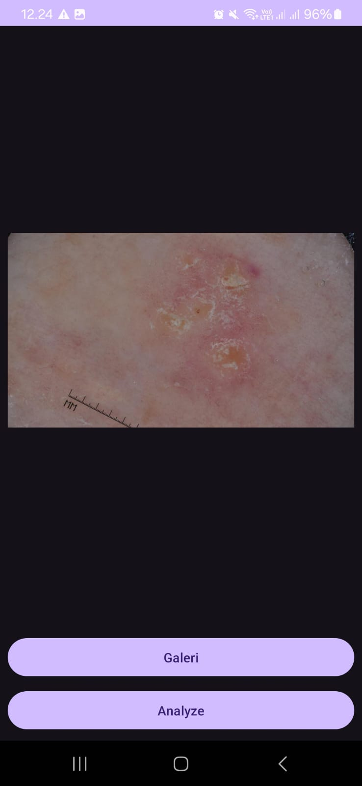
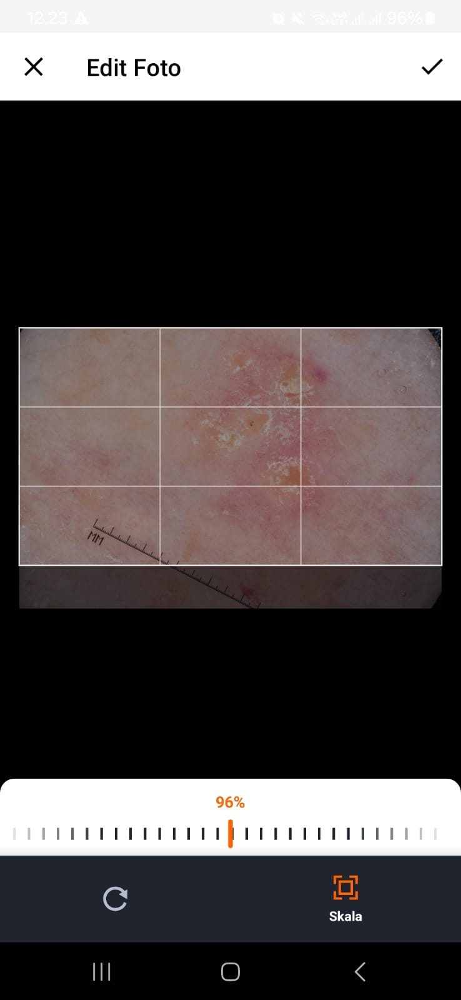
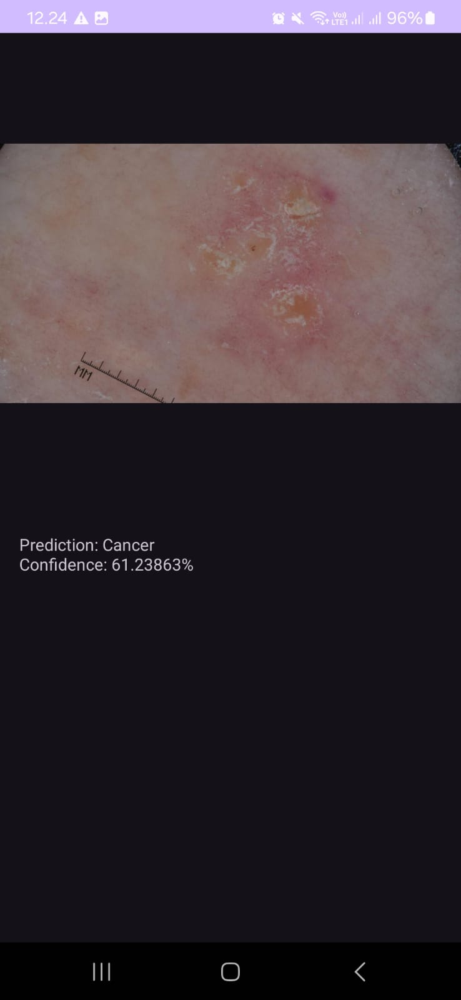

# kotlin-cancer-detection
Aplikasi Android yang dibangun dengan Kotlin untuk deteksi kanker menggunakan klasifikasi gambar dengan TensorFlow Lite. Aplikasi ini memungkinkan pengguna memilih gambar dari galeri, melakukan analisis secara real-time, dan melihat hasil prediksi untuk potensi diagnosis kanker.

## Features
- **Model Machine Learning**: Menggunakan model klasifikasi kanker yang bertujuan untuk memberikan analisis gambar.
- **Pemilihan Gambar dari Galeri**: Pengguna dapat memilih gambar dari galeri dengan opsi pemotongan dan rotasi.
- **Analisis Gambar Real-Time**: Menganalisis gambar menggunakan TensorFlow Lite secara real-time.
- **Tampilan Hasil Prediksi**: Hasil prediksi ditampilkan di layar hasil yang khusus.

## Tech Stack
- **Kotlin**: Bahasa pemrograman utama dalam pengembangan aplikasi ini.
- **Tensorflow Lite**: Versi ringan dari TensorFlow yang memungkinkan analisis gambar secara real-time di perangkat mobile, ideal untuk menerapkan model machine learning dengan efisiensi tinggi.
- **uCrop**: Library untuk pemotongan gambar yang memudahkan pengguna dalam memilih area yang relevan sebelum analisis, meningkatkan kualitas gambar yang akan diproses.
- **Android ViewModel dan Arsitektur MVVM (Model-View-ViewModel)**: ViewModel memisahkan logika presentasi dari UI dan menjaga data saat perubahan konfigurasi. Pendekatan MVVM memungkinkan pengelolaan status yang lebih baik dan pengalaman pengguna yang lebih responsif.

## Screenshots

## Authors

- [Muhammad Ikhwan Jaizy](https://github.com/jaizyikhwan)
